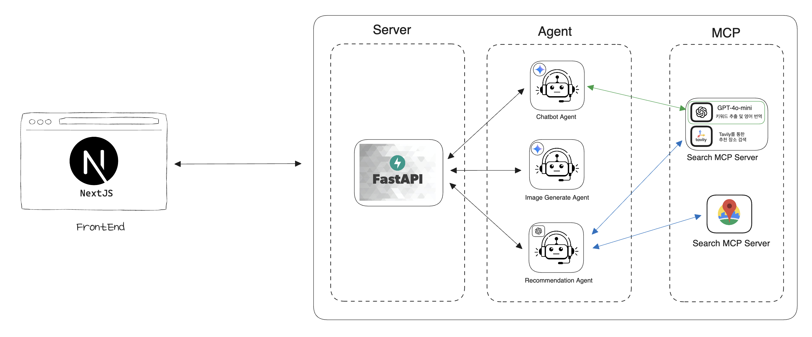
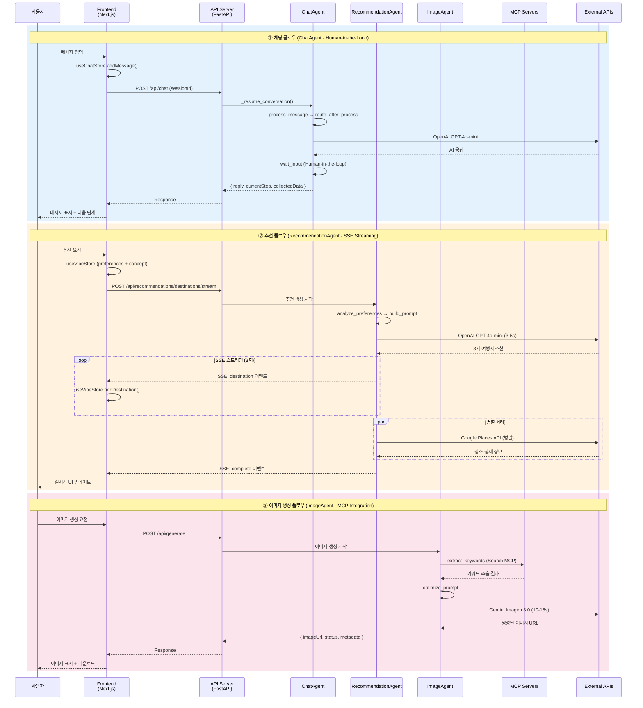
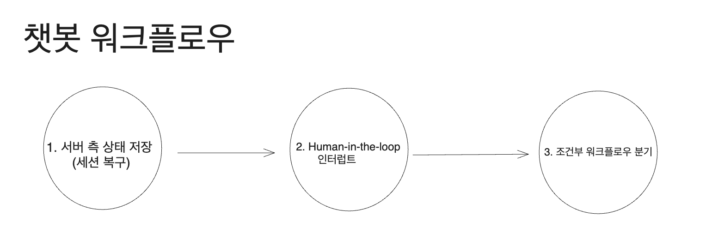
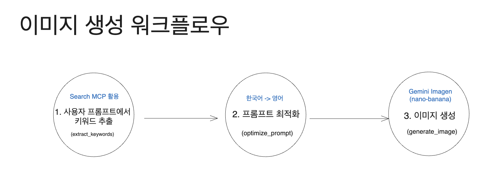
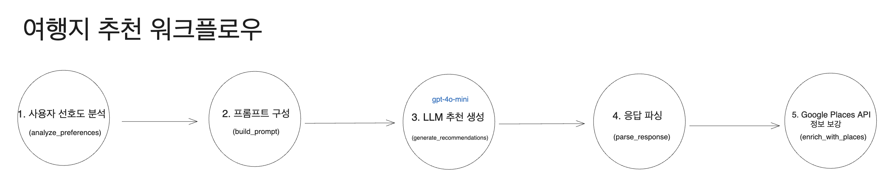

# **TripKit - AI 기반 감성 여행 플랫폼**

TripKit은 사용자의 여행 '분위기(Vibe)'를 AI가 분석하여 숨겨진 현지 명소, 필름 카메라 스타일링, 의상 컨셉까지 큐레이션하는 감성 여행 플랫폼입니다. 일반적인 관광지 추천이 아닌, **감성적 여행 경험 디자인**에 초점을 맞춘 서비스로, 인생샷과 스토리가 있는 여행을 원하는 2030 세대를 위한 완전히 새로운 여행 플래너입니다.

- **프로젝트 기간:** 2025.12.4 ~ 2025.12. (MVP 개발)
- **배포 링크:** [서비스 바로가기](링크 입력) _(이후 추가 예정)_
- **태그라인:** "당신은 티켓만 끊으세요. 여행의 '분위기(Vibe)'는 우리가 챙겨드립니다."

---

## **팀원 소개**

|  |  |
| :--------------------------------------------------------------: | :--------------------------------------------------------------: |
|             [이경섭](https://github.com/gyungsubLee)             |                [정지윤](https://github.com/EHW99)                |

---

## **1. 서비스 구성 요소**

### **1.1 주요 기능**

- **AI 챗봇 기반 Vibe 분석 (P0):** 10단계 대화를 통해 사용자의 여행 선호도(목적지, 꿈꾸는 장면, 동행자, 예산, 스타일)를 수집합니다. Human-in-the-loop 패턴으로 각 단계마다 사용자 입력을 기다리며, 세션 복구가 가능합니다.
- **3가지 감성 컨셉 선택 (P0):** Flâneur(도시 산책), Film Log(빈티지 필름), Midnight(예술적 시간 여행) 중 하나를 선택하여 모든 추천이 이 컨셉에 맞춰집니다.
- **숨겨진 현지 명소 추천 - SSE 스트리밍 (P0):** LLM이 생성한 3개의 여행지를 SSE 방식으로 실시간 스트리밍하며, Google Places API로 사진과 상세 정보를 보강합니다.
- **필름 감성 이미지 생성 (P1):** Gemini Imagen 3.0을 활용해 선택한 여행지의 필름 카메라 스타일 프리뷰 이미지를 생성합니다.
- **TripKit 패키지 (P1):** 여행지별로 [필름 카메라 + 필름 종류 + 카메라 설정 + 의상 스타일링 + 소품 + 베스트 앵글]을 포함한 완전한 여행 스타일링 패키지를 제공합니다.

### **1.2 사용자 흐름**

- **사용자 시나리오 예시:**
  1. **랜딩 페이지 (/)**: 서비스 소개 및 컨셉 미리보기 → "Get Started" 클릭
  2. **채팅 페이지 (/chat)**: AI와 10단계 대화를 통해 여행 Vibe 수집 (세션 저장, 7일 TTL)
  3. **컨셉 선택 (/concept)**: Flâneur/Film Log/Midnight 중 하나 선택
  4. **여행지 추천 (/destinations)**: SSE 스트리밍으로 3개 여행지 실시간 수신 및 캐러셀 탐색
  5. **TripKit 완성 (/tripkit)**: 선물 상자 언래핑 애니메이션과 함께 완성된 여행 패키지 확인
  6. **이미지 생성 (/generate)**: 선택한 여행지의 필름 감성 프리뷰 이미지 생성 및 다운로드

---

## **2. 활용 장비 및 협업 툴**

### **2.1 활용 장비**

- **개발 환경:** macOS 기반 개인 노트북 (M1 Pro)
- **서버 환경:** Docker Compose (로컬), Vercel (프론트엔드 배포 예정)
- **AI 서비스:** OpenAI GPT-4o-mini, Google Gemini (Imagen 3.0 + Gemini 2.5-flash)
- **MCP 서버:** Search MCP (포트 8050), Places MCP (포트 8052)

### **2.2 협업 툴**

- **소스 관리:** GitHub
- **프로젝트 관리:** Notion
- **커뮤니케이션:** Slack
- **버전 관리:** Git
- **문서화:** Markdown (docs/ 폴더)

---

## **3. 사용 기술 스택**

### **3.1 프론트엔드**

| 기술          | 버전   | 용도                                |
| ------------- | ------ | ----------------------------------- |
| Next.js       | 14.2+  | React 프레임워크 (App Router)       |
| React         | 18.3+  | UI 라이브러리                       |
| TypeScript    | 5.0+   | 타입 안전성                         |
| Tailwind CSS  | 3.4+   | 유틸리티 CSS 프레임워크             |
| Zustand       | 4.5+   | 경량 상태 관리 (persist middleware) |
| Framer Motion | 11.0+  | 애니메이션 라이브러리               |
| React Query   | 5.0+   | 서버 상태 관리 (선택적)             |
| Lucide React  | 0.400+ | 아이콘 라이브러리                   |

### **3.2 백엔드**

| 기술                   | 버전    | 용도                            |
| ---------------------- | ------- | ------------------------------- |
| Python                 | 3.12+   | 런타임                          |
| FastAPI                | 0.115+  | API 서버 프레임워크             |
| LangGraph              | 0.6.4+  | Agent 워크플로우 오케스트레이션 |
| LangChain              | 0.3.27+ | LLM 통합 프레임워크             |
| FastMCP                | 2.11+   | MCP 서버 프레임워크             |
| langchain-mcp-adapters | 0.1.9+  | MCP 어댑터                      |
| structlog              | 25.4+   | 구조화된 로깅                   |
| Pydantic               | 2.0+    | 데이터 검증                     |

### **3.3 AI 서비스**

| 서비스        | 모델                                 | 용도                           |
| ------------- | ------------------------------------ | ------------------------------ |
| OpenAI        | GPT-4o-mini                          | ChatAgent, RecommendationAgent |
| Google Gemini | Imagen 3.0 (imagen-3.0-generate-002) | ImageAgent 이미지 생성         |
| Google Gemini | Gemini 2.5-flash                     | 텍스트 생성 (백업)             |
| Google Maps   | Places API                           | 여행지 정보 보강               |
| Tavily        | Search API                           | 키워드 검색 (Search MCP)       |

### **3.4 배포 및 운영**

| 항목            | 기술                   |
| --------------- | ---------------------- |
| 컨테이너화      | Docker, Docker Compose |
| 프론트엔드 배포 | Vercel (예정)          |
| 백엔드 배포     | 로컬/클라우드 Docker   |
| 환경 변수 관리  | .env 파일              |
| 로깅            | structlog (JSON 형식)  |

---

## **4. 프로젝트 구조**

```
mintloop/
├── front/                      # Next.js 14 프론트엔드
│   ├── app/                    # App Router
│   │   ├── page.tsx            # 랜딩 페이지 (/)
│   │   ├── chat/page.tsx       # AI 채팅 (/chat)
│   │   ├── concept/page.tsx    # 컨셉 선택 (/concept)
│   │   ├── destinations/page.tsx # 여행지 추천 (/destinations)
│   │   ├── tripkit/page.tsx    # TripKit 패키지 (/tripkit)
│   │   ├── generate/page.tsx   # 이미지 생성 (/generate)
│   │   └── api/                # API Routes (Proxy)
│   │       ├── chat/route.ts
│   │       ├── recommendations/destinations/stream/route.ts
│   │       └── generate/route.ts
│   ├── components/             # React 컴포넌트
│   │   ├── ui/                 # 기본 UI (Button, Card, Modal)
│   │   ├── chat/               # 채팅 컴포넌트
│   │   ├── landing/            # 랜딩 페이지
│   │   ├── destinations/       # 여행지 카드
│   │   └── tripkit/            # GiftBox, Postcard
│   └── lib/                    # 유틸리티
│       ├── store/              # Zustand 스토어
│       │   ├── useChatStore.ts
│       │   └── useVibeStore.ts
│       └── types/index.ts      # TypeScript 타입
│
├── backend/                    # Python FastAPI 백엔드
│   ├── src/
│   │   ├── agents/             # LangGraph Agents
│   │   │   ├── chat_agent/     # ChatAgent (Human-in-the-loop)
│   │   │   ├── recommendation_agent/ # RecommendationAgent (SSE)
│   │   │   └── image_agent/    # ImageAgent (MCP)
│   │   ├── api_server/         # FastAPI 서버
│   │   │   ├── main.py         # 엔트리포인트
│   │   │   └── routers/        # API 라우터
│   │   └── mcp_servers/        # MCP 서버
│   │       ├── search_server.py  # Search MCP (포트 8050)
│   │       └── places_server.py  # Places MCP (포트 8052)
│   ├── docker-compose.yml      # Docker 구성
│   └── requirements.txt        # Python 의존성
│
├── docs/                       # 문서
│   ├── PRD_TripKit_MVP.md      # 제품 요구사항
│   ├── TRD_TripKit_MVP.md      # 기술 요구사항
│   ├── API_Documentation.md    # API 명세
│   └── AI_Integration_Guide.md # AI 통합 가이드
│
└── .env.sample                 # 환경변수 샘플
```

---

## **5. 서비스 아키텍처**

### **5.1 시스템 구조도**

TripKit은 Next.js 14 프론트엔드와 Python FastAPI 백엔드로 구성된 풀스택 애플리케이션입니다.



### **5.2 데이터 흐름도**



---

## **6. Agent 아키텍처 구조**

TripKit은 **ChatAgent**, **RecommendationAgent**, **ImageAgent** 3개의 LangGraph 기반 AI 에이전트로 구성됩니다.

### **6.1 ChatAgent - 대화형 컨텍스트 수집**



- **모델:** OpenAI GPT-4o-mini
- **구조:** LangGraph StateGraph + MemorySaver (세션 기반 상태 저장)
- **패턴:** Human-in-the-loop (각 단계마다 사용자 입력 대기)
- **기능:** 10단계 대화를 통해 여행 선호도 수집 (destination → scene → companion → duration → budget → style)
- **세션 관리:** 7일 TTL, session_id 기반 복구 가능

### **6.2 ImageAgent - 필름 감성 이미지 생성**



- **모델:** Google Gemini Imagen 3.0 (imagen-3.0-generate-002)
- **구조:** LangGraph StateGraph + MCP 서버 통합
- **워크플로우:**
  1. **extract_keywords** (Search MCP) - 텍스트에서 핵심 키워드 추출
  2. **optimize_prompt** (직접 구현) - 프롬프트 품질 향상
  3. **generate_image** (Gemini Imagen) - 필름 스타일 이미지 생성
- **출력:** 1024x1024 고화질 필름 감성 이미지

### **6.3 RecommendationAgent - 여행지 추천 + SSE 스트리밍**



- **모델:** OpenAI GPT-4o-mini (추천 생성)
- **구조:** Strategy Pattern (OpenAI/Gemini Provider 교체 가능)
- **기능:**
  - LLM 기반 여행지 추천 (3개)
  - Google Places API 병렬 호출로 정보 보강 (ThreadPoolExecutor)
  - SSE 스트리밍으로 실시간 전송 (destination 이벤트 3회 + complete 이벤트 1회)
- **성능 최적화:** gpt-4o-mini 사용으로 응답 시간 70% 감소, 병렬 API 호출로 3배 개선

### **6.4 평가 지표**

| 메트릭               | 목표 | 측정 방법                             |
| -------------------- | ---- | ------------------------------------- |
| 채팅 응답 시간       | <3s  | API 응답 시간                         |
| 추천 생성 (SSE)      | <10s | 첫 번째 destination → complete 이벤트 |
| 이미지 생성          | <15s | Imagen API 응답 시간                  |
| Places API 병렬 호출 | <2s  | ThreadPoolExecutor 실행 시간          |
| 추천 정확도          | 70%+ | 사용자 피드백 (정성 평가)             |

---

## **7. 설치 및 실행 방법**

### **7.1 환경변수 설정**

프로젝트 루트의 `.env.sample` 파일을 참고하여 `.env` 파일을 생성하고 필요한 인증 정보를 설정합니다.

필수 환경변수:

- OpenAI 인증 토큰
- Google Gemini 인증 토큰
- Google Maps 인증 토큰
- LLM Provider 설정 (openai/gemini)
- MCP 서버 포트 설정

### **7.2 백엔드 실행 (Docker - 권장)**

```bash
cd backend

# 전체 서비스 시작 (FastAPI + MCP 서버)
docker-compose --env-file ../.env up -d

# 로그 확인
docker-compose logs -f

# 서비스 중지
docker-compose down
```

### **7.3 백엔드 실행 (로컬)**

```bash
cd backend

# 가상환경 생성 및 활성화
python -m venv .venv
source .venv/bin/activate  # Windows: .venv\Scripts\activate

# 의존성 설치
pip install -r requirements.txt

# 터미널 1: Search MCP Server
python -m src.mcp_servers.search_server

# 터미널 2: Places MCP Server
python -m src.mcp_servers.places_server

# 터미널 3: API Server
uvicorn src.api_server.main:app --reload --port 8000
```

### **7.4 프론트엔드 실행**

```bash
cd front

# 의존성 설치
npm install

# 환경변수 설정 (.env.local)
echo "BACKEND_URL=http://localhost:8000" > .env.local

# 개발 서버 실행
npm run dev
# → http://localhost:3000

# 프로덕션 빌드
npm run build
npm run start

# 코드 품질 검사
npm run lint
npm run type-check
```

---

## **8. 참고 자료**

### **8.1 공식 문서 - 프론트엔드**

- [Next.js 14 Documentation](https://nextjs.org/docs)
- [Zustand Documentation](https://docs.pmnd.rs/zustand)
- [Tailwind CSS](https://tailwindcss.com/docs)
- [Framer Motion](https://www.framer.com/motion/)

### **8.2 공식 문서 - 백엔드**

- [FastAPI 공식 문서](https://fastapi.tiangolo.com/)
- [LangGraph Documentation](https://langchain-ai.github.io/langgraph/)
- [LangChain Documentation](https://python.langchain.com/)
- [FastMCP GitHub](https://github.com/jlowin/fastmcp)

### **8.3 서비스 문서**

- [OpenAI Reference](https://platform.openai.com/docs/api-reference)
- [Google Gemini Imagen](https://cloud.google.com/vertex-ai/docs/generative-ai/image/overview)
- [Google Places](https://developers.google.com/maps/documentation/places)

### **8.4 프로젝트 내부 문서**

- [PRD (Product Requirements)](./docs/PRD_TripKit_MVP.md) - 제품 요구사항 명세
- [TRD (Technical Requirements)](./docs/TRD_TripKit_MVP.md) - 기술 요구사항 명세
- [Documentation](./docs/API_Documentation.md) - 상세 문서
- [Integration Guide](./docs/AI_Integration_Guide.md) - 통합 가이드
- [Frontend Design Spec](./docs/Frontend_Design_Specification.md) - 프론트엔드 디자인 명세

### **8.5 주요 업데이트 내역**

| 날짜       | 업데이트 내용                                                  | 브랜치 |
| :--------- | :------------------------------------------------------------- | :----- |
| 2025.12.03 | 프로젝트 초기 설정, ChatAgent Human-in-the-loop 패턴 구현      | main   |
| 2025.12.04 | RecommendationAgent SSE 스트리밍 구현, Google Places 통합      | main   |
| 2025.12.06 | ImageAgent Gemini Imagen 통합, MCP 서버 구축 (Search, Places)  | main   |
| 2025.12.08 | 프론트엔드 6-page 플로우 완성, Zustand 세션 관리, 컨셉 선택 UI | main   |
| 2025.12.10 | 성능 최적화 (gpt-4o-mini 전환), Places 병렬화, 문서 업데이트   | main   |

---
