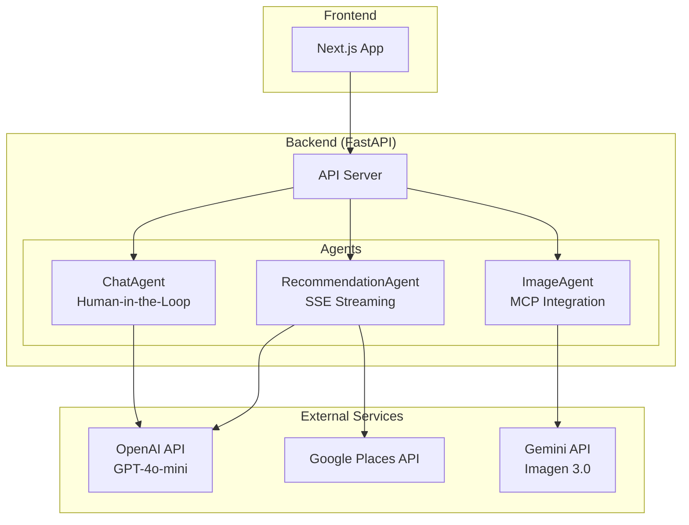
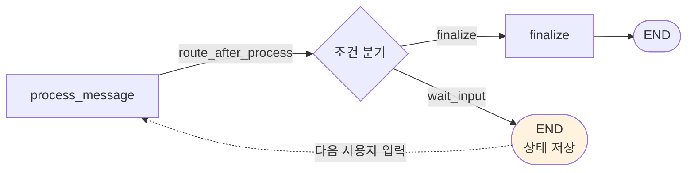
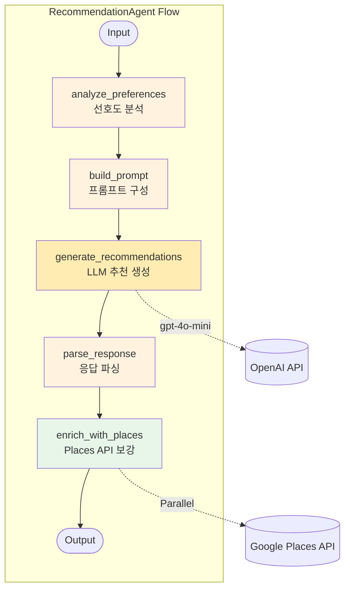
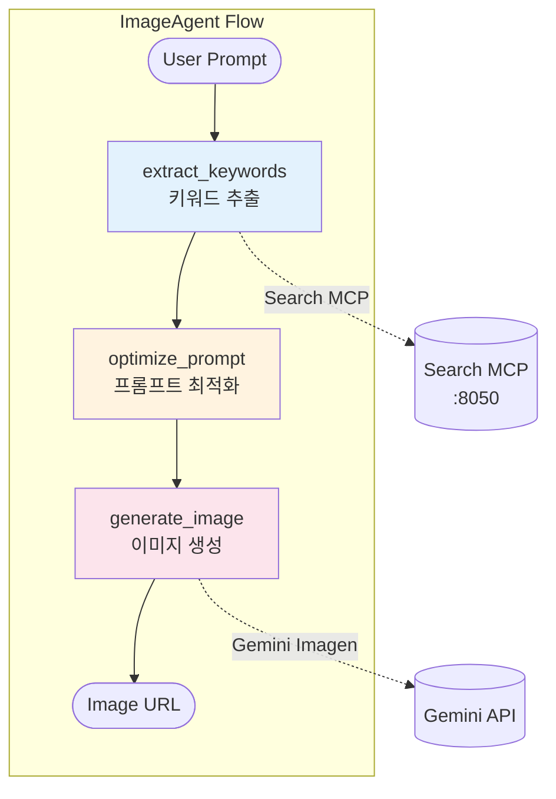

# TripKit Backend - AI Agent System

## 개요

TripKit 백엔드는 3개의 AI Agent로 구성된 여행 추천 및 이미지 생성 시스템입니다.

- **ChatAgent**: 대화형 여행 컨텍스트 수집
- **RecommendationAgent**: LLM 기반 여행지 추천
- **ImageAgent**: 필름 감성 이미지 생성

## 시스템 아키텍처



---

## Agent 상세 아키텍처

### 1. ChatAgent (대화형 컨텍스트 수집)

**위치**: `src/agents/chat_agent/`

**목적**: 10단계 대화를 통해 사용자의 여행 컨텍스트를 수집

**핵심 특징**: Human-in-the-Loop 패턴으로 각 단계마다 사용자 입력 대기

```mermaid
graph LR
    subgraph ChatAgent["ChatAgent Flow"]
        direction LR
        Start([Start]) --> Greeting[1. greeting]
        Greeting --> City[2. city]
        City --> Spot[3. spot]
        Spot --> Action[4. action]
        Action --> Concept[5. concept]
        Concept --> Outfit[6. outfit]
        Outfit --> Pose[7. pose]
        Pose --> Film[8. film]
        Film --> Camera[9. camera]
        Camera --> Complete[10. complete]
        Complete --> End([End])
    end

    style Greeting fill:#e1f5fe
    style City fill:#e1f5fe
    style Spot fill:#e1f5fe
    style Action fill:#e1f5fe
    style Concept fill:#e1f5fe
    style Outfit fill:#e1f5fe
    style Pose fill:#e1f5fe
    style Film fill:#e1f5fe
    style Camera fill:#e1f5fe
    style Complete fill:#c8e6c9
```



#### State 구조

```python
class ChatState(TypedDict):
    messages: Annotated[list[BaseMessage], add_messages]
    current_step: ConversationStep  # 현재 대화 단계
    context: TravelContext          # 수집된 여행 컨텍스트
    is_complete: bool               # 완료 여부
```

#### 대화 단계별 수집 정보

| Step | 수집 정보 | 예시 |
|------|----------|------|
| greeting | 인사 | "안녕하세요!" |
| city | 여행 도시 | "파리" |
| spot | 방문 장소 | "에펠탑 근처 카페" |
| action | 하고 싶은 활동 | "산책하면서 사진 찍기" |
| concept | 컨셉 | "빈티지 필름 감성" |
| outfit | 의상 스타일 | "베이지 트렌치코트" |
| pose | 포즈/구도 | "창가에 앉아서" |
| film | 필름 종류 | "Kodak Portra 400" |
| camera | 카메라 | "Contax T2" |
| complete | 완료 | 최종 컨텍스트 확인 |

#### Human-in-the-loop 메커니즘

**LangGraph 워크플로우**:



**핵심 구성 요소**:

| 구성 요소 | 역할 |
|-----------|------|
| `wait_input → END` | 그래프 실행 중단 (인터럽트 지점) |
| `MemorySaver` | 상태 영속화 (`session_id` 기준) |
| `_resume_conversation()` | 저장된 상태 복원 후 그래프 재실행 |
| `route_after_process()` | 완료/대기 분기 결정 |

**세션 복구 흐름**:

```python
# 1. 첫 번째 입력
[사용자 입력] → process_message → wait_input → END (상태 저장)

# 2. 두 번째 입력 (재개)
[사용자 입력] → _resume_conversation() → 기존 상태 복원 → process_message → ...
```

---

### 2. RecommendationAgent (여행지 추천)

**위치**: `src/agents/recommendation_agent/`

**목적**: 사용자 선호도 기반 여행지 추천 + Google Places API 정보 보강

**핵심 특징**:
- Strategy Pattern으로 LLM Provider 교체 가능 (OpenAI/Gemini)
- SSE 스트리밍으로 실시간 결과 전송
- ThreadPoolExecutor로 Places API 병렬 호출



#### State 구조

```python
class RecommendationState(TypedDict):
    messages: Annotated[list[BaseMessage], add_messages]
    user_preferences: dict          # 사용자 선호도
    concept: str                    # 선택된 컨셉
    travel_scene: str               # 꿈꾸는 여행 장면
    travel_destination: str         # 관심 지역
    image_generation_context: dict  # 이미지 생성 컨텍스트
    llm_provider: str               # LLM Provider (openai/gemini)
    model: str                      # 모델명 (gpt-4o-mini)
    user_profile: dict              # 분석된 사용자 프로필
    system_prompt: str              # 시스템 프롬프트
    user_prompt: str                # 사용자 프롬프트
    raw_response: str               # LLM 원본 응답
    destinations: list[dict]        # 추천 여행지 목록
    status: str                     # 상태 (pending/completed/failed)
    error: str | None               # 에러 메시지
```

#### 성능 최적화

| 최적화 항목 | Before | After | 개선율 |
|------------|--------|-------|--------|
| LLM 모델 | gpt-4o | gpt-4o-mini | 응답 시간 70% 감소 |
| Places API | 순차 호출 | ThreadPoolExecutor 병렬 | 3배 빠름 |
| SSE 스트리밍 | 2-phase | Single-phase | 단순화 |
| 토큰 출력 | ~2700 tokens | ~1000 tokens | 63% 감소 |

#### SSE 이벤트 형식

```typescript
// destination 이벤트 (3회)
{
  type: "destination",
  index: 0,
  total: 3,
  destination: { id, name, description, ... },
  isFallback: false
}

// complete 이벤트 (1회)
{
  type: "complete",
  total: 3,
  userProfile: { ... },
  isFallback: false
}
```

---

### 3. ImageAgent (이미지 생성)

**위치**: `src/agents/image_agent/`

**목적**: 필름 감성 여행 이미지 생성

**핵심 특징**:
- MCP (Model Context Protocol) 서버 통합
- Gemini Imagen 3.0 사용
- 키워드 추출 → 프롬프트 최적화 → 이미지 생성



> **Note**: `optimize_prompt`는 MCP 서버를 사용하지 않고 직접 구현되어 있습니다.

#### State 구조

```python
class ImageGenerationState(TypedDict):
    messages: Annotated[list[BaseMessage], add_messages]
    user_prompt: str                # 사용자 입력 텍스트
    extracted_keywords: list[str]   # 추출된 키워드
    optimized_prompt: str           # 최적화된 프롬프트
    generated_image_url: str | None # 생성된 이미지 URL
    image_metadata: dict | None     # 이미지 메타데이터
    status: Literal["pending", "extracting", "generating", "completed", "failed"]
    error: str | None
```

#### MCP 서버 구성

| 서버 | 포트 | 기능 |
|------|------|------|
| Search MCP | 8050 | `extract_keywords`: 텍스트에서 키워드 추출 |
| Image MCP | 8051 | `generate_image`: Gemini Imagen으로 이미지 생성 |

> **Note**: `optimize_prompt`는 MCP 서버가 아닌 `nodes.py`에서 직접 구현됩니다.

---

## 빠른 시작

### 1. 환경 설정

```bash
cd backend

# 가상환경 생성 및 활성화
python -m venv .venv
source .venv/bin/activate  # Windows: .venv\Scripts\activate

# 의존성 설치
pip install -r requirements.txt
```

### 2. 환경변수 설정

프로젝트 루트의 `.env` 파일 참조:

```env
# 필수 API Keys
OPENAI_API_KEY=sk-...          # OpenAI API
GEMINI_API_KEY=AIza...         # Gemini API
GOOGLE_MAP_API_KEY=AIza...     # Google Places API

# LLM 설정
LLM_PROVIDER=openai
LLM_MODEL=gpt-4o-mini

# Gemini 설정
GEMINI_TEXT_MODEL=gemini-2.5-flash
GEMINI_IMAGE_MODEL=imagen-3.0-generate-002
IMAGE_PROVIDER=gemini

# MCP 서버 포트
SEARCH_MCP_PORT=8050
IMAGE_MCP_PORT=8051
```

### 3. 서버 실행

#### Docker (권장)

```bash
# 전체 서비스 시작
docker-compose up -d

# 로그 확인
docker-compose logs -f

# 서비스 중지
docker-compose down
```

#### 로컬 실행

```bash
# 터미널 1: Search MCP Server
python -m src.mcp_servers.search_server

# 터미널 2: Image MCP Server
python -m src.mcp_servers.image_server

# 터미널 3: API Server
uvicorn src.api_server.main:app --reload --port 8000
```

---

## API 엔드포인트

### Chat API

```
POST /api/chat
Content-Type: application/json

{
  "message": "파리에 가고 싶어요",
  "thread_id": "user-123"
}
```

### Recommendations API

```
POST /api/recommendations/destinations/stream
Content-Type: application/json

{
  "preferences": { "mood": "romantic" },
  "concept": "filmlog",
  "travelScene": "석양이 지는 해변",
  "travelDestination": "유럽"
}
```

### Image Generation API

```
POST /api/generate/image
Content-Type: application/json

{
  "prompt": "파리 에펠탑 앞에서 빈티지 드레스를 입고",
  "filmStock": "Kodak Portra 400",
  "style": "film photography"
}
```

---

## 기술 스택

| 기술 | 버전 | 용도 |
|------|------|------|
| Python | 3.12+ | 런타임 |
| LangGraph | 0.6.4+ | Agent 워크플로우 |
| LangChain | 0.3.27+ | LLM 통합 |
| FastAPI | 0.115+ | API 서버 |
| FastMCP | 2.11+ | MCP 서버 프레임워크 |
| OpenAI | 1.0+ | GPT-4o-mini |
| Google AI | - | Gemini Imagen 3.0 |
| structlog | 25.4+ | 구조화된 로깅 |

---

## 프로젝트 구조

```
backend/
├── src/
│   ├── agents/
│   │   ├── chat_agent/           # 대화형 컨텍스트 수집
│   │   │   ├── agent.py          # ChatAgent 클래스
│   │   │   ├── nodes.py          # 대화 노드 구현
│   │   │   └── state.py          # State 정의
│   │   │
│   │   ├── recommendation_agent/ # 여행지 추천
│   │   │   ├── agent.py          # RecommendationAgent 클래스
│   │   │   ├── nodes.py          # 추천 노드 구현
│   │   │   ├── prompts.py        # LLM 프롬프트
│   │   │   └── state.py          # State 정의
│   │   │
│   │   └── image_agent/          # 이미지 생성
│   │       ├── agent.py          # ImageAgent 클래스
│   │       ├── nodes.py          # 이미지 생성 노드
│   │       └── state.py          # State 정의
│   │
│   ├── api_server/               # FastAPI 서버
│   │   ├── main.py               # 엔트리포인트
│   │   ├── routers/              # API 라우터
│   │   └── config/               # 설정
│   │
│   └── mcp_servers/              # MCP 서버
│       ├── search_server.py      # 검색/키워드 MCP
│       └── image_server.py       # 이미지 생성 MCP
│
├── tests/                        # 테스트
├── docker-compose.yml            # Docker 구성
└── requirements.txt              # Python 의존성
```

---

## 성능 지표

| 메트릭 | 목표 | 현재 |
|--------|------|------|
| Chat 응답 | <3s | ~2s |
| 추천 생성 (SSE) | <10s | ~8s |
| 이미지 생성 | <15s | ~12s |
| Places API (3개 병렬) | <2s | ~1s |

---

## 문제 해결

### MCP 서버 연결 실패

```
ConnectionError: Failed to connect to MCP server
```

**해결**: MCP 서버가 실행 중인지 확인

```bash
# 포트 확인
lsof -i :8050
lsof -i :8051
```

### API 키 오류

```
AuthenticationError: Invalid API key
```

**해결**: `.env` 파일의 API 키 확인

### 추천 응답 느림

**해결**:
1. `LLM_MODEL=gpt-4o-mini` 확인
2. Docker 재빌드: `docker-compose build --no-cache`

---

## 참고 자료

- [LangGraph 공식 문서](https://langchain-ai.github.io/langgraph/)
- [FastMCP 문서](https://github.com/jlowin/fastmcp)
- [OpenAI API](https://platform.openai.com/docs)
- [Google Places API](https://developers.google.com/maps/documentation/places)
- [Gemini Imagen](https://cloud.google.com/vertex-ai/docs/generative-ai/image/overview)

---

## 라이센스

MIT License
