# Trip Kit API Documentation
## Vibe-Driven Travel API Reference - v2.0

**"여행의 감성을 설계하는 AI API"**
*AI API That Designs Your Travel Vibe*

---

## 📋 Document Information

- **API Version**: 2.0.0
- **Last Updated**: 2025-12-10
- **Architecture**: Frontend (Next.js) → Backend (FastAPI) Proxy
- **Backend Base URL**: `http://localhost:8000` (development)
- **Frontend Base URL**: `http://localhost:3000/api` (development proxy)
- **Protocol**: HTTPS (production), HTTP (development)
- **Content-Type**: `application/json`
- **Related Documents**: [TRD](./TRD_TripKit_MVP.md), [PRD](./PRD_TripKit_MVP.md), [Sub-Agent Architecture](./Sub_Agent_Architecture.md)

### API Architecture

```
Frontend (Next.js)          Backend (FastAPI)
     |                            |
     ├─ /api/chat ──────────────► POST /chat (ChatAgent)
     ├─ /api/recommendations/
     │   ├─ destinations ───────► POST /recommendations/destinations
     │   └─ destinations/stream ► POST /recommendations/destinations/stream (SSE)
     └─ /api/generate ──────────► POST /generate (Gemini Imagen)
```

### API Philosophy
This API enables **vibe-driven travel experiences** by:
1. **Extracting emotional preferences** through session-based conversational AI
2. **Matching vibes to hidden local spots** with SSE streaming delivery
3. **Visualizing the experience** through Gemini Imagen film-aesthetic generation
4. **Providing complete styling packages** for authentic aesthetic documentation

---

## 🔐 Authentication

**MVP Status**: No authentication required (public endpoints)

**Future Implementation**: JWT-based authentication
```typescript
// Future authentication header
Authorization: Bearer <jwt-token>
```

---

## 📊 Rate Limiting

### Limits per IP Address
| Endpoint Category | Limit | Window |
|-------------------|-------|--------|
| Chat endpoints | 100 requests | 1 hour |
| Recommendation endpoints | 50 requests | 1 hour |
| Image generation | 20 requests | 1 hour |

### Rate Limit Headers
```http
X-RateLimit-Limit: 100
X-RateLimit-Remaining: 95
X-RateLimit-Reset: 1638360000
```

### Rate Limit Error Response
```json
{
  "error": "RATE_LIMIT_EXCEEDED",
  "message": "Too many requests. Please try again in 30 minutes.",
  "retryAfter": 1800
}
```

---

## 🚨 Error Handling

### Standard Error Response
```json
{
  "error": "ERROR_CODE",
  "message": "Human-readable error message",
  "details": {
    "field": "Additional context (optional)"
  },
  "timestamp": "2025-12-03T10:30:00Z"
}
```

### Error Codes
| Code | HTTP Status | Description |
|------|-------------|-------------|
| `VALIDATION_ERROR` | 400 | Invalid request parameters |
| `SESSION_NOT_FOUND` | 404 | Session ID not found |
| `RATE_LIMIT_EXCEEDED` | 429 | Too many requests |
| `INTERNAL_ERROR` | 500 | Server-side error |
| `PROVIDER_ERROR` | 503 | AI provider (Gemini/OpenAI) failure |
| `TIMEOUT` | 504 | Request timeout |

---

## 📡 API Endpoints

---

## 1. Chat API (Session-Based Conversation)

### POST /chat

**Purpose**: Session-based vibe extraction conversation using ChatAgent with LangGraph Human-in-the-loop pattern.

**Backend Agent**: ChatAgent (LangGraph StateGraph with MemorySaver)

#### Request

```http
POST /chat
Content-Type: application/json

{
  "message": "I'm looking for a romantic, vintage vibe trip",
  "sessionId": "550e8400-e29b-41d4-a716-446655440000",
  "userId": "user_123"
}
```

#### Request Parameters

| Field | Type | Required | Description |
|-------|------|----------|-------------|
| `message` | string | Yes | User's chat message |
| `sessionId` | string (UUID) | Yes | Session identifier (client-generated) |
| `userId` | string | No | Optional user identifier |

#### Response (200 OK)

```json
{
  "reply": "Great! Romantic and vintage sounds wonderful. Which city are you thinking of?",
  "currentStep": "city",
  "nextStep": "spot_name",
  "isComplete": false,
  "collectedData": {
    "city": null,
    "spotName": null,
    "conceptId": null,
    "mainAction": null,
    "outfitStyle": null,
    "filmType": null,
    "cameraModel": null
  },
  "rejectedItems": {
    "cities": [],
    "spots": [],
    "actions": [],
    "concepts": [],
    "outfits": [],
    "poses": [],
    "films": [],
    "cameras": []
  },
  "suggestedOptions": ["Paris", "Rome", "Lisbon", "Prague"],
  "sessionId": "550e8400-e29b-41d4-a716-446655440000"
}
```

#### Response Fields

| Field | Type | Description |
|-------|------|-------------|
| `reply` | string | AI-generated response message |
| `currentStep` | string | Current conversation step |
| `nextStep` | string | Next expected step |
| `isComplete` | boolean | Whether TripKit profile is complete |
| `collectedData` | object | Accumulated TripKit profile data |
| `rejectedItems` | object | Items user has rejected (for exclusion) |
| `suggestedOptions` | array | Quick-reply suggestions |
| `sessionId` | string | Echo of session ID |

#### Conversation Steps

```
greeting → city → spot_name → concept → main_action → outfit_style →
film_type → camera_model → summary → complete
```

#### TypeScript Example

```typescript
const response = await fetch('/api/chat', {
  method: 'POST',
  headers: { 'Content-Type': 'application/json' },
  body: JSON.stringify({
    message: userMessage,
    sessionId: sessionId,
  }),
});

const data = await response.json();

// Update UI with response
setMessages(prev => [...prev, { role: 'assistant', content: data.reply }]);
setCurrentStep(data.currentStep);
setCollectedData(data.collectedData);
```

---

### GET /chat/{session_id}/history

**Purpose**: Retrieve conversation history for session recovery (e.g., after browser refresh).

#### Response (200 OK)

```json
{
  "sessionId": "550e8400-e29b-41d4-a716-446655440000",
  "history": [
    { "role": "user", "content": "I want a romantic trip" },
    { "role": "assistant", "content": "Great! Which city are you thinking of?" }
  ],
  "currentStep": "city",
  "collectedData": { "city": null },
  "isComplete": false
}
```

---

### GET /chat/{session_id}/state

**Purpose**: Get current session state only (without full conversation history).

#### Response (200 OK)

```json
{
  "current_step": "city",
  "collected_data": { "city": null },
  "rejected_items": { "cities": [] },
  "is_complete": false
}
```

---

## 2. Destination Recommendations

### POST /recommendations/destinations

**Purpose**: Get destination recommendations that match user's travel vibe.

**Backend Agent**: RecommendationAgent (LangGraph 5-step workflow)

#### Request

```http
POST /recommendations/destinations
Content-Type: application/json

{
  "preferences": {
    "mood": "romantic",
    "aesthetic": "vintage",
    "duration": "medium",
    "interests": ["photography", "art"]
  },
  "concept": "filmlog",
  "travelScene": "Walking through cobblestone streets at golden hour",
  "travelDestination": "Europe"
}
```

#### Request Parameters

| Field | Type | Required | Description |
|-------|------|----------|-------------|
| `preferences.mood` | string | No | User's mood preference |
| `preferences.aesthetic` | string | No | Aesthetic preference |
| `preferences.duration` | string | No | Trip duration |
| `preferences.interests` | array | No | User interests |
| `concept` | string | No | Selected concept (flaneur/filmlog/midnight) |
| `travelScene` | string | No | Dream travel scene description |
| `travelDestination` | string | No | Preferred region/country |

#### Response (200 OK)

```json
{
  "status": "completed",
  "destinations": [
    {
      "id": "dest_abc123",
      "name": "Cinque Terre Hidden Trails",
      "city": "Cinque Terre",
      "country": "Italy",
      "description": "Lesser-known hiking paths connecting colorful cliffside villages...",
      "matchReason": "Combines romantic coastal views with vintage Italian charm...",
      "localVibe": "Authentic fishing village atmosphere",
      "whyHidden": "Away from cruise ship tourist routes",
      "bestTimeToVisit": "Late April - Early June",
      "photographyScore": 9,
      "transportAccessibility": "moderate",
      "safetyRating": 9,
      "estimatedBudget": "$$",
      "tags": ["coastal", "hiking", "photography", "authentic"],
      "photographyTips": [
        "Golden hour provides warm light on pastel buildings",
        "Use wide aperture for bokeh with village background"
      ],
      "storyPrompt": "A solo traveler discovering hidden paths above the sea...",
      "activities": [
        {
          "name": "Sunrise at Riomaggiore",
          "description": "Watch fishermen prepare boats at dawn",
          "duration": "1-2 hours",
          "bestTime": "5:30-7:00 AM",
          "localTip": "Bring coffee from Bar Centrale",
          "photoOpportunity": "Silhouettes against morning light"
        }
      ]
    }
  ],
  "userProfile": {
    "primary_mood": "romantic",
    "aesthetic_preference": "vintage",
    "interests": ["photography", "art"]
  },
  "isFallback": false
}
```

---

### POST /recommendations/destinations/stream (SSE)

**Purpose**: Stream destination recommendations via Server-Sent Events for progressive UI updates.

**Delivery Pattern**: LLM generates → Parse → Google Places API enrichment → Stream to client

#### Request

Same as `/recommendations/destinations`

#### SSE Response Stream

```
data: {"type": "destination", "index": 0, "total": 3, "destination": {...}, "isFallback": false}

data: {"type": "destination", "index": 1, "total": 3, "destination": {...}, "isFallback": false}

data: {"type": "destination", "index": 2, "total": 3, "destination": {...}, "isFallback": false}

data: {"type": "complete", "total": 3, "userProfile": {...}, "isFallback": false}
```

#### SSE Event Types

| Type | Description |
|------|-------------|
| `destination` | Single destination data (enriched with Google Places) |
| `complete` | Stream completion with summary |
| `error` | Error occurred during streaming |

#### TypeScript Example (SSE Consumption)

```typescript
const loadDestinationsStream = async () => {
  const response = await fetch('/api/recommendations/destinations/stream', {
    method: 'POST',
    headers: { 'Content-Type': 'application/json' },
    body: JSON.stringify({ preferences, concept }),
    signal: abortController.signal,
  });

  const reader = response.body?.getReader();
  const decoder = new TextDecoder();
  let buffer = '';

  while (true) {
    const { done, value } = await reader.read();
    if (done) break;

    buffer += decoder.decode(value, { stream: true });
    const lines = buffer.split('\n');
    buffer = lines.pop() || '';

    for (const line of lines) {
      if (line.startsWith('data: ')) {
        const event = JSON.parse(line.slice(6));

        if (event.type === 'destination') {
          // Add to UI immediately for progressive rendering
          addDestination(event.destination);
        } else if (event.type === 'complete') {
          setLoading(false);
        }
      }
    }
  }
};
```

---

## 3. Image Generation

### POST /generate

**Purpose**: Generate AI preview image with film aesthetic using **Gemini Imagen**.

**Backend**: Gemini Imagen 3.0 (imagen-3.0-generate-002)

#### Request

```http
POST /generate
Content-Type: application/json

{
  "destination": "Cinque Terre, Italy",
  "concept": "filmlog",
  "filmStock": "kodak_portra",
  "filmType": "35mm color negative",
  "filmStyleDescription": "Warm tones, natural skin, fine grain",
  "outfitStyle": "Vintage denim jacket, white sundress",
  "additionalPrompt": "Looking at the ocean from a cliff",
  "chatContext": {
    "city": "Cinque Terre",
    "spotName": "Via dell'Amore Overlook",
    "mainAction": "Gazing at the sea",
    "outfitStyle": "Linen dress with straw hat",
    "posePreference": "Back to camera, natural stance",
    "filmType": "Kodak Portra 400",
    "cameraModel": "Canon AE-1"
  },
  "conversationSummary": "User wants romantic coastal vibe..."
}
```

#### Request Parameters

| Field | Type | Required | Description |
|-------|------|----------|-------------|
| `destination` | string | Yes | Location name |
| `concept` | string | Yes | Aesthetic concept |
| `filmStock` | string | Yes | Film stock identifier |
| `filmType` | string | No | Film format description |
| `filmStyleDescription` | string | No | Film characteristics |
| `outfitStyle` | string | No | Outfit description |
| `additionalPrompt` | string | No | Additional scene details |
| `chatContext` | object | No | Context from chat conversation |
| `conversationSummary` | string | No | Summary of user preferences |

#### Response (200 OK)

```json
{
  "status": "success",
  "imageUrl": "https://storage.googleapis.com/tripkit-images/generated/abc123.png",
  "optimizedPrompt": "A young woman in vintage linen dress with straw hat, standing on a cliff overlooking Cinque Terre coastline. Shot on Kodak Portra 400 film with Canon AE-1...",
  "extractedKeywords": ["Cinque Terre", "filmlog", "Kodak Portra 400", "coastal"],
  "poseUsed": "Back to camera, natural stance",
  "metadata": {
    "concept": "filmlog",
    "filmStock": "kodak_portra",
    "destination": "Cinque Terre, Italy",
    "provider": "gemini",
    "model": "imagen-3.0-generate-002"
  }
}
```

#### Response (Error)

```json
{
  "status": "error",
  "error": "Image generation failed: Content policy violation"
}
```

#### Response Fields

| Field | Type | Description |
|-------|------|-------------|
| `status` | string | `success` or `error` |
| `imageUrl` | string | Generated image URL |
| `optimizedPrompt` | string | Final prompt sent to Imagen |
| `extractedKeywords` | array | Keywords extracted from request |
| `poseUsed` | string | Pose/action used in generation |
| `metadata` | object | Generation metadata including provider |
| `error` | string | Error message (if failed) |

#### Film Stocks Available

| ID | Name | Characteristics |
|----|------|-----------------|
| `kodak_colorplus` | Kodak ColorPlus 200 | Warm, saturated, budget-friendly |
| `kodak_portra` | Kodak Portra 400 | Natural skin tones, subtle colors |
| `kodak_gold` | Kodak Gold 200 | Warm yellows, classic look |
| `fuji_superia` | Fujifilm Superia 400 | Vibrant, saturated greens |
| `fuji_c200` | Fujifilm C200 | Cool tones, everyday film |
| `ilford_hp5` | Ilford HP5 Plus | B&W, high contrast |
| `cinestill_800t` | CineStill 800T | Tungsten, cinematic halation |

---

## 4. Health Check

### GET /health

**Purpose**: API health status check.

#### Response (200 OK)

```json
{
  "status": "healthy",
  "version": "2.2.0",
  "timestamp": "2025-12-10T10:00:00Z"
}
```

---

## 📚 Common Workflows

### Workflow 1: Complete User Journey

```mermaid
sequenceDiagram
    participant U as User
    participant F as Frontend
    participant B as Backend

    U->>F: Start conversation
    F->>B: POST /chat (sessionId)
    B-->>F: Welcome + suggestedOptions

    loop Chat Loop (8-10 exchanges)
        U->>F: Select option / type message
        F->>B: POST /chat (same sessionId)
        B-->>F: Reply + collectedData update
    end

    Note over B: ChatAgent completes TripKit profile

    U->>F: Select concept (Flâneur/Film Log/Midnight)
    F->>B: POST /recommendations/destinations/stream (SSE)

    loop SSE Stream
        B-->>F: destination event (1/3)
        F->>U: Show card immediately
        B-->>F: destination event (2/3)
        F->>U: Show card immediately
        B-->>F: destination event (3/3)
        F->>U: Show card immediately
        B-->>F: complete event
    end

    U->>F: Select destination
    F->>B: POST /generate
    B-->>F: Generated image URL
    F->>U: Display film aesthetic preview
```



### Workflow 2: Session Recovery (Browser Refresh)

```typescript
// On page load, check for existing session
const sessionId = localStorage.getItem('tripkit_session_id');

if (sessionId) {
  const response = await fetch(`/api/chat/${sessionId}/history`);
  const { history, currentStep, collectedData, isComplete } = await response.json();

  if (history.length > 0) {
    // Restore conversation state
    setMessages(history);
    setCurrentStep(currentStep);
    setCollectedData(collectedData);
  }
}
```

### Workflow 3: Direct Recommendation (Skip Chat)

```typescript
// For users who want to skip conversation
const quickRecommendation = async () => {
  const response = await fetch('/api/recommendations/destinations', {
    method: 'POST',
    headers: { 'Content-Type': 'application/json' },
    body: JSON.stringify({
      preferences: {
        mood: 'romantic',
        aesthetic: 'vintage',
        duration: 'medium',
        interests: ['photography'],
      },
      concept: 'filmlog',
      travelDestination: 'Italy',
    }),
  });

  const { destinations } = await response.json();
  return destinations;
};
```

---

## 🧪 Testing & Development

### Sample Session ID
```
550e8400-e29b-41d4-a716-446655440000
```

### Sample Preferences
```json
{
  "mood": "romantic",
  "aesthetic": "vintage",
  "duration": "medium",
  "interests": ["photography", "art"],
  "concept": "filmlog"
}
```

### cURL Examples

**Chat Request:**
```bash
curl -X POST http://localhost:8000/chat \
  -H "Content-Type: application/json" \
  -d '{
    "message": "I want a romantic trip to Italy",
    "sessionId": "550e8400-e29b-41d4-a716-446655440000"
  }'
```

**SSE Streaming:**
```bash
curl -N -X POST http://localhost:8000/recommendations/destinations/stream \
  -H "Content-Type: application/json" \
  -d '{
    "preferences": { "mood": "romantic" },
    "concept": "filmlog"
  }'
```

**Image Generation:**
```bash
curl -X POST http://localhost:8000/generate \
  -H "Content-Type: application/json" \
  -d '{
    "destination": "Cinque Terre, Italy",
    "concept": "filmlog",
    "filmStock": "kodak_portra",
    "outfitStyle": "Vintage linen dress"
  }'
```

---

## 📊 Monitoring & Analytics

### Recommended Metrics

1. **API Performance**
   - Response times per endpoint
   - SSE stream completion rate
   - Error rates by endpoint

2. **User Behavior**
   - Chat conversation completion rate
   - Average messages to completion
   - Most selected concepts
   - Image generation success rate

3. **Agent Performance**
   - ChatAgent: Steps to completion
   - RecommendationAgent: LLM + Places API latency
   - ImageAgent: Generation success rate

---

## 📝 Changelog

### v2.0.0 (2025-12-10)
- 🔄 **BREAKING**: Image generation switched from DALL-E 3 to **Gemini Imagen**
- ✨ Added SSE streaming endpoint `/recommendations/destinations/stream`
- ✨ Added session history endpoint `/chat/{session_id}/history`
- ✨ Added session state endpoint `/chat/{session_id}/state`
- 🔄 Updated Chat API to session-based architecture
- 🔄 Updated response models with `collectedData`, `rejectedItems`, `suggestedOptions`
- 📝 Updated documentation to reflect FastAPI backend architecture

### v1.0.0 (2025-12-03)
- ✨ Initial MVP release
- 🚀 5 core endpoints operational
- 🎯 LangGraph-powered chatbot
- 🖼️ DALL-E 3 image generation (deprecated in v2.0.0)

---

**API Documentation Version**: 2.0.0
**Last Updated**: 2025-12-10
**Status**: ✅ Production Ready
