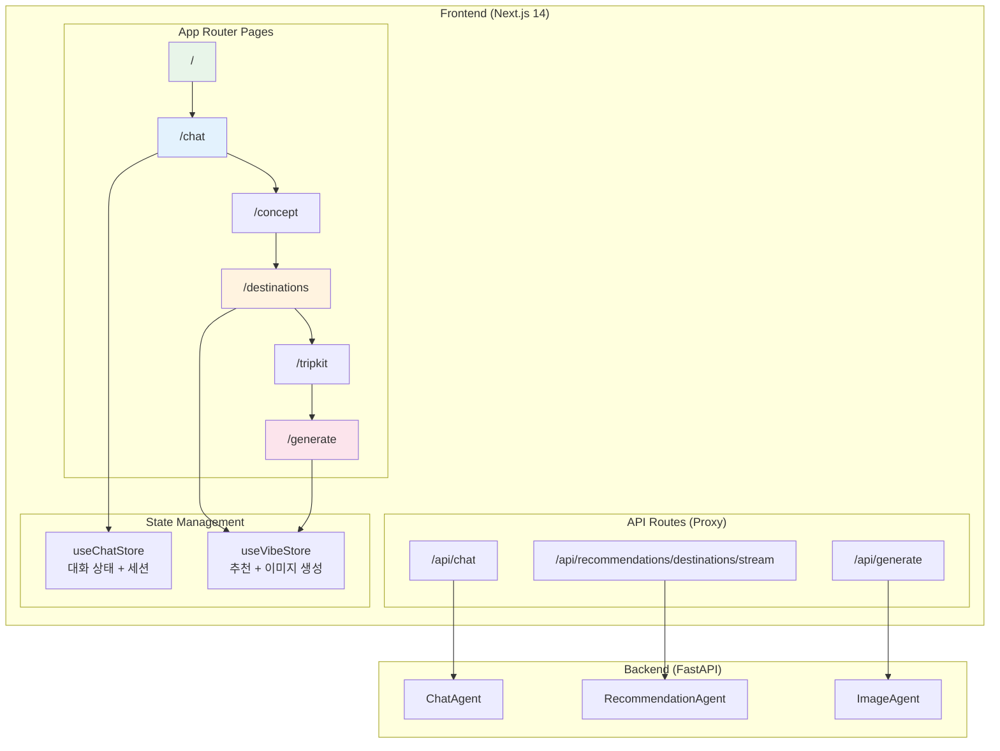

# TripKit Frontend - Next.js 14 Application

## 개요

TripKit 프론트엔드는 AI 기반 Vibe 여행 큐레이션 서비스를 위한 Next.js 14 애플리케이션입니다.

- **프레임워크**: Next.js 14 (App Router)
- **언어**: TypeScript 5.0+
- **스타일링**: Tailwind CSS + Framer Motion
- **상태관리**: Zustand (persist middleware)

## 시스템 아키텍처



---

## 페이지 구조

### 사용자 플로우

```
[Landing] → [Chat] → [Concept] → [Destinations] → [TripKit] → [Generate]
    │          │          │            │              │           │
    │          │          │            │              │           └── 이미지 생성
    │          │          │            │              └── 여행 패키지 완성
    │          │          │            └── SSE 스트리밍 추천
    │          │          └── 컨셉 선택 (flaneur/filmlog/midnight)
    │          └── AI 대화 (10단계 Human-in-the-loop)
    └── 랜딩 페이지
```

### 페이지 상세

| 경로 | 컴포넌트 | 설명 |
|------|----------|------|
| `/` | `HomePage` | 랜딩 페이지 (Hero, ConceptPreview, FeatureShowcase, CTA) |
| `/chat` | `ChatContainer` | AI 대화 인터페이스 (10단계 여행 컨텍스트 수집) |
| `/concept` | `ConceptPage` | 여행 컨셉 선택 (Flâneur, Film Log, Midnight) |
| `/destinations` | `DestinationsPage` | SSE 스트리밍 여행지 추천 캐러셀 |
| `/tripkit` | `TripKitPage` | 완성된 여행 패키지 (선물 상자 UI) |
| `/generate` | `GeneratePage` | 필름 감성 이미지 생성 |

---

## 컴포넌트 구조

```
components/
├── ui/                    # 기본 UI 컴포넌트
│   ├── Button.tsx         # 버튼 (variant: primary/secondary/ghost)
│   ├── Card.tsx           # 카드 컨테이너
│   ├── Badge.tsx          # 태그/배지
│   ├── Modal.tsx          # 모달 다이얼로그
│   ├── Input.tsx          # 입력 필드
│   ├── Progress.tsx       # 진행률 바
│   └── Skeleton.tsx       # 로딩 스켈레톤
│
├── landing/               # 랜딩 페이지 컴포넌트
│   ├── Hero.tsx           # 히어로 섹션
│   ├── ConceptPreview.tsx # 컨셉 미리보기
│   ├── FeatureShowcase.tsx # 기능 소개
│   └── CallToAction.tsx   # CTA 섹션
│
├── chat/                  # 채팅 컴포넌트
│   ├── ChatContainer.tsx  # 채팅 메인 컨테이너
│   ├── MessageBubble.tsx  # 메시지 버블
│   ├── ChatInput.tsx      # 입력 필드
│   ├── QuickReply.tsx     # 빠른 답변 버튼
│   ├── ProgressBar.tsx    # 대화 진행률
│   └── TypingIndicator.tsx # 타이핑 인디케이터
│
├── destinations/          # 여행지 컴포넌트
│   ├── DestinationCard.tsx # 여행지 카드
│   └── DestinationModal.tsx # 상세 모달
│
├── tripkit/               # TripKit 컴포넌트
│   ├── GiftBox.tsx        # 선물 상자 컨테이너
│   ├── WrappedGift.tsx    # 포장된 선물
│   └── Postcard.tsx       # 여행 엽서
│
└── layout/                # 레이아웃 컴포넌트
    ├── Header.tsx         # 헤더
    └── Footer.tsx         # 푸터
```

---

## 상태 관리

### Zustand Stores

#### 1. `useChatStore` - 대화 상태 관리

```typescript
interface ChatState {
  // Session
  sessionId: string;
  sessionCreatedAt: number;
  sessionLastActiveAt: number;

  // Messages
  messages: Message[];
  currentStep: ConversationStep;  // init → mood → aesthetic → ... → complete

  // Collected Data
  collectedData: TripKitProfile;
  rejectedItems: RejectedItems;

  // Actions
  initSession: () => string;      // 세션 초기화/복구
  resetSession: () => string;     // 세션 리셋
  addMessage: (msg) => void;      // 메시지 추가
  loadFromHistory: (history) => void;  // 세션 복구
}
```

**특징**:
- `persist` middleware로 localStorage 저장
- 7일 TTL 세션 관리
- 백엔드 ChatAgent와 세션 ID 동기화

#### 2. `useVibeStore` - 추천 및 이미지 생성 상태

```typescript
interface VibeState {
  // User Selection
  selectedConcept: Concept | null;
  selectedDestination: Destination | null;
  preferences: UserPreferences;

  // Recommendations
  destinations: Destination[];        // SSE로 점진적 추가
  hiddenSpots: HiddenSpot[];

  // Image Generation
  generatedImages: GeneratedImage[];
  imageGenerationContext: ImageGenerationContext | null;

  // TripKit 챗봇
  tripKitProfile: TripKitProfile;
  tripKitStep: TripKitStep;

  // Actions
  addDestination: (dest) => void;    // 스트리밍 destination 추가
  clearDestinations: () => void;     // 새 추천 시 초기화
  setImageGenerationContext: (ctx) => void;
}
```

**특징**:
- SSE 스트리밍 결과 실시간 반영
- 이미지 생성 컨텍스트 추적
- 일부 필드만 localStorage 저장 (partialize)

---

## API Routes (Proxy Layer)

### `/api/chat` - 채팅 API

```typescript
POST /api/chat
{
  message: string;
  sessionId: string;
  userId?: string;
}

→ Backend: POST /chat
← Response: { reply, currentStep, nextStep, isComplete, collectedData }
```

### `/api/recommendations/destinations/stream` - SSE 스트리밍

```typescript
POST /api/recommendations/destinations/stream
{
  preferences: UserPreferences;
  concept?: Concept;
  travelScene?: string;
  imageGenerationContext?: {...};
}

→ Backend: POST /recommendations/destinations/stream
← SSE Events:
   data: { type: "destination", destination: {...} }
   data: { type: "complete", total: 3 }
```

### `/api/generate` - 이미지 생성

```typescript
POST /api/generate
{
  locationId: string;
  locationName: string;
  concept: Concept;
  filmStock: string;
  outfitStyle: string;
}

→ Backend: ImageAgent API
← Response: { imageUrl, status }
```

---

## 주요 기능 구현

### 1. SSE 스트리밍 소비 (destinations/page.tsx)

```typescript
const loadDestinationsStream = useCallback(async () => {
  const response = await fetch("/api/recommendations/destinations/stream", {
    method: "POST",
    body: JSON.stringify({ preferences, concept }),
    signal: abortControllerRef.current.signal,
  });

  const reader = response.body?.getReader();
  const decoder = new TextDecoder();
  let buffer = "";

  while (true) {
    const { done, value } = await reader.read();
    if (done) break;

    buffer += decoder.decode(value, { stream: true });
    const lines = buffer.split("\n");
    buffer = lines.pop() || "";

    for (const line of lines) {
      if (line.startsWith("data: ")) {
        const event = JSON.parse(line.slice(6));
        if (event.type === "destination") {
          addDestination(event.destination);  // 실시간 UI 업데이트
        }
      }
    }
  }
}, []);
```

### 2. 세션 복구 (useChatStore)

```typescript
initSession: () => {
  const state = get();
  const now = Date.now();

  // 유효한 세션이 있으면 재사용
  if (state.sessionId && (now - state.sessionCreatedAt) < SESSION_TTL) {
    set({ sessionLastActiveAt: now });
    return state.sessionId;
  }

  // 새 세션 생성
  const newSessionId = generateSessionId();
  set({ ...initialState, sessionId: newSessionId });
  return newSessionId;
}
```

---

## 타입 시스템

### 핵심 타입 (`lib/types/index.ts`)

```typescript
// 대화 단계
type ConversationStep = 'init' | 'mood' | 'aesthetic' | 'duration' | 'interests' | 'destination' | 'complete';

// TripKit 프로필
interface TripKitProfile {
  city?: string;
  spotName?: string;
  conceptId?: Concept;
  mainAction?: string;
  outfitStyle?: string;
  filmType?: string;
  cameraModel?: string;
}

// 여행지
interface Destination {
  id: string;
  name: string;
  city: string;
  country: string;
  description: string;
  matchReason: string;
  placeDetails?: PlaceDetails;  // Google Places API
}

// 컨셉
type Concept = 'flaneur' | 'filmlog' | 'midnight' | 'pastoral' | 'noir' | 'seaside';
```

---

## 빠른 시작

### 1. 의존성 설치

```bash
cd front
npm install
```

### 2. 환경변수 설정

```env
# .env.local
BACKEND_URL=http://localhost:8000
AGENT_API_URL=http://localhost:8000
```

### 3. 개발 서버 실행

```bash
npm run dev
# → http://localhost:3000
```

### 4. 빌드 및 배포

```bash
npm run build    # 프로덕션 빌드
npm run start    # 프로덕션 서버
npm run lint     # ESLint
npm run type-check  # TypeScript 검사
```

---

## 기술 스택

| 기술 | 버전 | 용도 |
|------|------|------|
| Next.js | 14.2+ | React 프레임워크 (App Router) |
| React | 18.3+ | UI 라이브러리 |
| TypeScript | 5.0+ | 타입 안전성 |
| Tailwind CSS | 3.4+ | 유틸리티 CSS |
| Zustand | 4.5+ | 상태 관리 |
| Framer Motion | 11.0+ | 애니메이션 |
| React Query | 5.0+ | 서버 상태 관리 |
| Lucide React | 0.400+ | 아이콘 |
| Zod | 3.22+ | 스키마 검증 |

---

## 프로젝트 구조

```
front/
├── app/                       # App Router
│   ├── page.tsx               # 랜딩 페이지
│   ├── layout.tsx             # 루트 레이아웃
│   ├── providers.tsx          # Context Providers
│   ├── globals.css            # 글로벌 스타일
│   ├── chat/page.tsx          # 채팅 페이지
│   ├── concept/page.tsx       # 컨셉 선택
│   ├── destinations/page.tsx  # 여행지 추천
│   ├── tripkit/page.tsx       # TripKit 완성
│   ├── generate/page.tsx      # 이미지 생성
│   └── api/                   # API Routes
│       ├── chat/route.ts
│       ├── recommendations/destinations/
│       │   ├── route.ts
│       │   └── stream/route.ts
│       └── generate/route.ts
│
├── components/                # React 컴포넌트
│   ├── ui/                    # 기본 UI
│   ├── landing/               # 랜딩 페이지
│   ├── chat/                  # 채팅
│   ├── destinations/          # 여행지
│   ├── tripkit/               # TripKit
│   └── layout/                # 레이아웃
│
├── lib/                       # 유틸리티
│   ├── types/index.ts         # TypeScript 타입
│   ├── store/                 # Zustand 스토어
│   │   ├── useChatStore.ts
│   │   └── useVibeStore.ts
│   ├── constants/             # 상수
│   │   ├── concepts.ts
│   │   └── filmStocks.ts
│   └── utils/
│       └── cn.ts              # clsx + tailwind-merge
│
├── public/                    # 정적 파일
├── tailwind.config.ts         # Tailwind 설정
├── tsconfig.json              # TypeScript 설정
└── package.json               # 의존성
```

---

## 디자인 시스템

### 색상 팔레트

```css
/* Sepia (Primary) */
--sepia-50: #faf8f5;
--sepia-500: #8b7355;
--sepia-700: #5c4d3d;

/* Cream (Background) */
--cream-50: #fdfcfa;
--cream-200: #f0ebe3;

/* Gray (Text) */
--gray-500: #6b7280;
--gray-900: #111827;
```

### 폰트

```typescript
// app/layout.tsx
const libreBaskerville = Libre_Baskerville({
  weight: ['400', '700'],
  style: ['normal', 'italic'],
  variable: '--font-libre',  // 제목용 (세리프)
});

const inter = Inter({
  weight: ['300', '400', '500', '600', '700'],
  variable: '--font-inter',  // 본문용 (산세리프)
});
```

---

## 성능 최적화

| 최적화 항목 | 구현 |
|------------|------|
| SSE 스트리밍 | 점진적 UI 렌더링 (3개 여행지) |
| 코드 스플리팅 | Next.js App Router 자동 분할 |
| 이미지 최적화 | next/image 컴포넌트 |
| 상태 영속화 | Zustand persist (localStorage) |
| 스켈레톤 UI | 로딩 상태 UX 개선 |
| AbortController | 중복 요청 취소 |

---

## 참고 자료

- [Next.js 14 Documentation](https://nextjs.org/docs)
- [Zustand Documentation](https://docs.pmnd.rs/zustand)
- [Framer Motion](https://www.framer.com/motion/)
- [Tailwind CSS](https://tailwindcss.com/docs)

---

## 라이센스

MIT License
